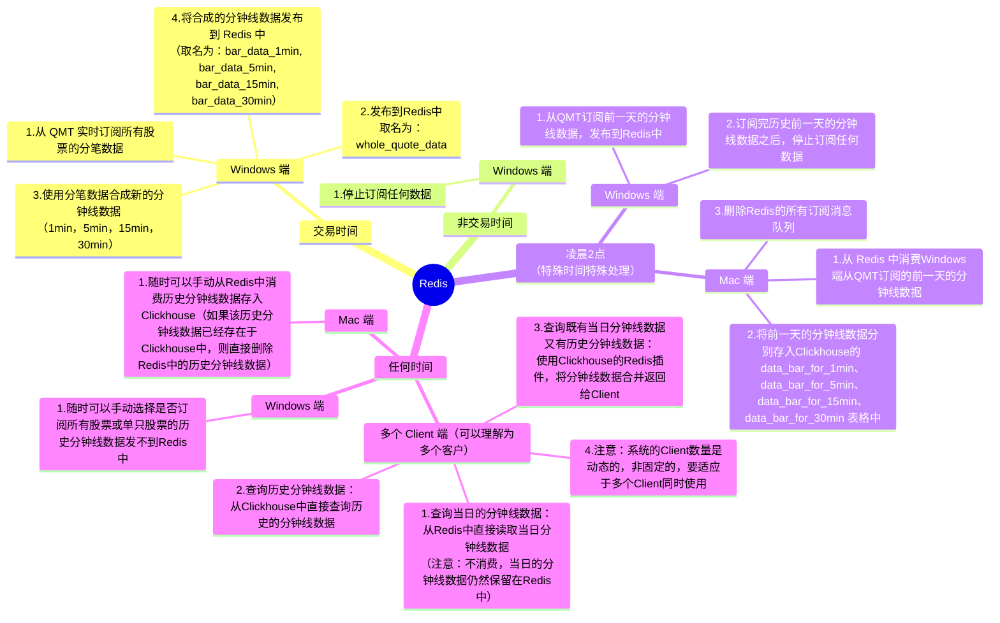

# 21 天驯化 AI 打工仔：开发量化交易系统（九）系统逻辑优化与分钟线数据合成

## 系统流程图



注意：
- 所有的分钟线数据（不论是当日合成的数据还是订阅的历史分钟线数据）都必须是**交易时间内**的数据。不然没有意义。
- 当日合成的分钟线数据是保存在Redis中的，不要存入Clickhouse。
- 只有从QMT订阅的历史的分钟线数据是通过Redis保存在Clickhouse中的，请注意与当日合成的分钟线数据进行区分。

## 参考
- Clickhouse 的 Redis 插件：https://clickhouse.com/docs/zh/engines/table-engines/integrations/redis
- Clickhouse 的物化视图：https://clickhouse.com/docs/zh/engines/table-engines/integrations/materialized-postgresql

## 配置
### Redis配置
redis:
  host: 8.217.201.221          # Redis服务器地址
  port: 16379                  # Redis端口
  password: quantide666        # Redis认证密码
  db: 0                        # Redis数据库编号
  decode_responses: true       # 自动解码响应

### ClickHouse配置
clickhouse:
  host: localhost              # ClickHouse服务器地址
  port: 8123                   # ClickHouse端口
  user: default                # 用户名
  password: "123456"                 # 密码
  database: v1            # 数据库名

## 数据格式

### 分钟线数据格式
历史分钟线数据格式和当日的分钟线数据格式，均以下述的数据格式存储：
```
symbol str
frame datetime.date
open float64
high float64
low float64
close float64
vol float64
amount float64
```
历史分钟线订阅接口参考官方文档：https://dict.thinktrader.net/nativeApi/xtdata.html#%E8%AE%A2%E9%98%85%E6%A8%A1%E5%9E%8B

### 分笔数据格式
接口参考：https://dict.thinktrader.net/nativeApi/xtdata.html#%E8%AE%A2%E9%98%85%E5%85%A8%E6%8E%A8%E8%A1%8C%E6%83%85
按照api原格式存储，要求保存订阅号。

## 代码要求
分别给我三个文件夹，分别用于windows端，mac端和多Client端。
- windows端：文件夹中的代码运行后会弹出一个Web页面，用于查看该系统
  - 系统运行状态
  - 该系统的数据存储情况
  - 该系统的数据查询情况
- mac端：文件夹中的代码运行后会弹出一个Web页面，用于查看该系统
  - 系统运行状态
  - 该系统的数据存储情况
  - 该系统的数据查询情况
- 多Client端：文件夹中的代码运行后会弹出一个Web页面，用于查询和展示查询结果。
  - 如果查询的分钟线数据是当日的，则直接从Redis中读取合成的分钟线数据
  - 如果查询的分钟线数据是历史的，则直接从Clickhouse中读取
  - 如果查询的分钟线数据是既有当日的又有历史的，则使用Clickhouse的Redis插件将数据合并返回给Client

可以理解为windows端和mac端为管理者，其他的Client为普通用户。

